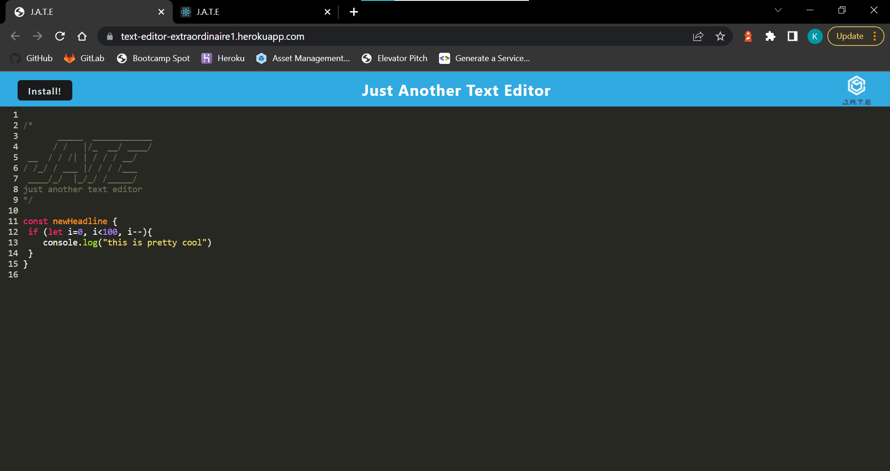

# text-editor-extraordinaire

# Discription
When adding text to the page it will be edited to look like it is being written in JavaScript, Along with it being edited into a certain style it will also save the data entered locally and in the indexedDB webpack.

# Table of Contents

-[Description](#description)
-[Installation](#installation)
-[Deployed](#deployed-link)
-[App Screenshot](#app-screenshot)
    

# Installation

Access application through the deployment link.  

# App Screenshot

Screenshot

# Deployed Link
[Deployed Page Link](https://text-editor-extraordinaire1.herokuapp.com/)

